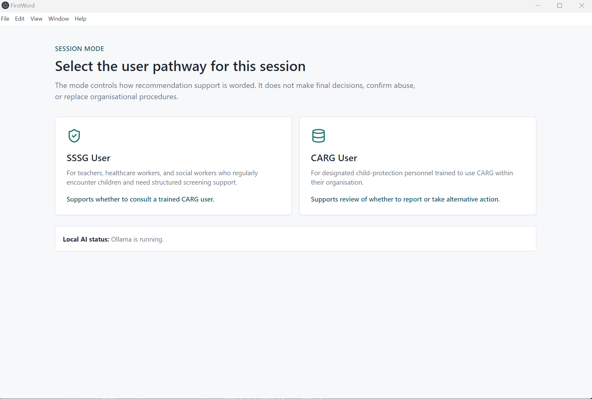
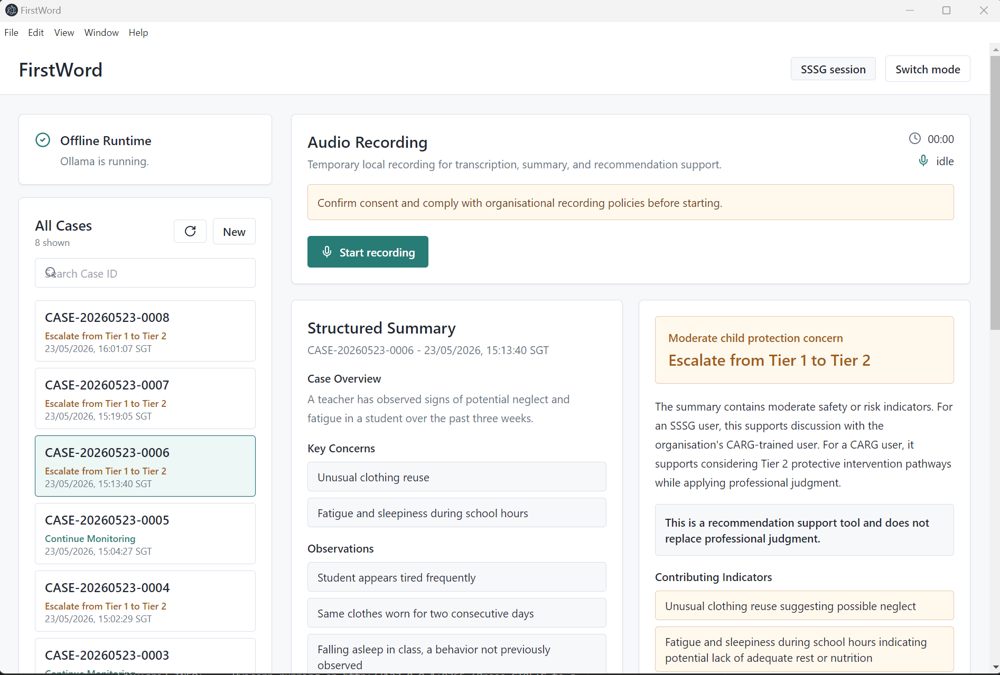

# Her Code Her Cause Hackathon (Problem 1)

Problem Statement: Teachers, healthcare workers, volunteers, and other frontline professionals may encounter signs of family violence but often lack quick access to practical guidance on how to respond appropriately. Existing resources are fragmented and not easily accessible at the moment help is needed. 

Challenge: How might technology provide just-in-time guidance and decision support for non-specialist professionals who may encounter potential family violence situations, while preserving confidentiality and professional judgement?

# FirstWord

FirstWord is designed to support frontline professionals in documenting observations, assessing potential concerns, and making informed decisions on whether a suspected case of child abuse should be escalated.

FirstWord enables frontline professionals to record their observations through voice input, speeding up the documentation process. Audio recordings are transcribed, summarised, and consolidated with any previous case notes. The consolidated information is then assessed against the Break the Silence guidelines published by the Ministry of Social and Family Development (MSF) (Source: *https://www.msf.gov.sg/what-we-do/break-the-silence/home*).

Afterwhich, FirstWord would generate recommendations on the next appropriate steps, helping frontline professionals make an objective decision. 

By operating offline and storing only case IDs of each child, the solution ensures that information remains confidential. The application would also be accessible in environments with limited internet connectivity.

### Home Screen



### Case Management Screen



## Safety Boundaries

- The app would only provide recommendations, it does not confirm abuse, generate criminal accusations, or override professional judgment.
- Raw transcripts are held in memory only and are not stored.
- Recommendations are advisory and always display: "This is a recommendation support tool and does not replace professional judgment."
- The frontline professionals have the final say on whether the case should be escalated the case.

## Prerequisites

- Windows 10/11
- Node.js 18+
- Python 3.10+
- Ollama installed locally
- Qwen2.5 model pulled locally, for example `ollama pull qwen2.5:7b-instruct`
- Faster-Whisper model available locally or downloadable during setup

Runtime operation is offline. However, an online setup environment is required for dependency/model installations before use.

## Setup

```powershell
python -m venv .venv
.\.venv\Scripts\Activate.ps1
pip install -r requirements.txt
npm install
npm run dev
```

The Electron window opens after the React frontend and FastAPI backend are healthy.

## Configuration

Environment variables can be placed in `.env`:

```text
APP_DB_PATH=local-data/app.db
WHISPER_MODEL_SIZE=medium
WHISPER_DEVICE=cpu
WHISPER_COMPUTE_TYPE=int8
OLLAMA_BASE_URL=http://127.0.0.1:11434
OLLAMA_MODEL=qwen2.5:7b-instruct
OLLAMA_NUM_CTX=4096
OLLAMA_NUM_PREDICT=1200
OLLAMA_TIMEOUT_SECONDS=300
```

Use `WHISPER_DEVICE=cuda` and a compatible compute type only on machines with CUDA configured. If transcription fails with `CUDA driver version is insufficient for CUDA runtime version`, either update the NVIDIA driver or set:

```text
WHISPER_DEVICE=cpu
WHISPER_COMPUTE_TYPE=int8
```

FirstWord will also fall back to CPU `int8` automatically when CUDA fails with a driver/runtime mismatch.

### Ollama GPU Startup

Ollama runs as a separate local process. Project `.env` values configure this app's connection to Ollama, but they do not change an already-running Ollama process.

To start Ollama with a specific NVIDIA GPU from this project:

```powershell
.\scripts\start-ollama-gpu.ps1 -GpuId 0
```

Then load Qwen:

```powershell
ollama run qwen2.5:7b-instruct
```

Check placement:

```powershell
ollama ps
nvidia-smi
```

In `ollama ps`, the `PROCESSOR` column should show `100% GPU` or a CPU/GPU split. If it shows `100% CPU`, update the NVIDIA driver and restart Ollama.

## Data Storage

The cases are stored in SQLite tables with information which includes case IDs, timestamps, structured summaries, recommendation labels, rationales, contributing indicators, uncertainty notes, and user mode. Raw recordings and transcripts are never persisted.

## Approved Guidance Snapshot

The recommendation engine uses a local snapshot derived from Singapore MSF Break The Silence website (*as of 23 May 2026*) for:

- SSSG and CARG roles
- Tier 1 and Tier 2 protection principles
- Signs of physical, sexual, emotional/psychological abuse and neglect

## Project Presentation

[Download the PowerPoint](PresentationSlides/WOMEN DEV HACKATHON.pdf)
